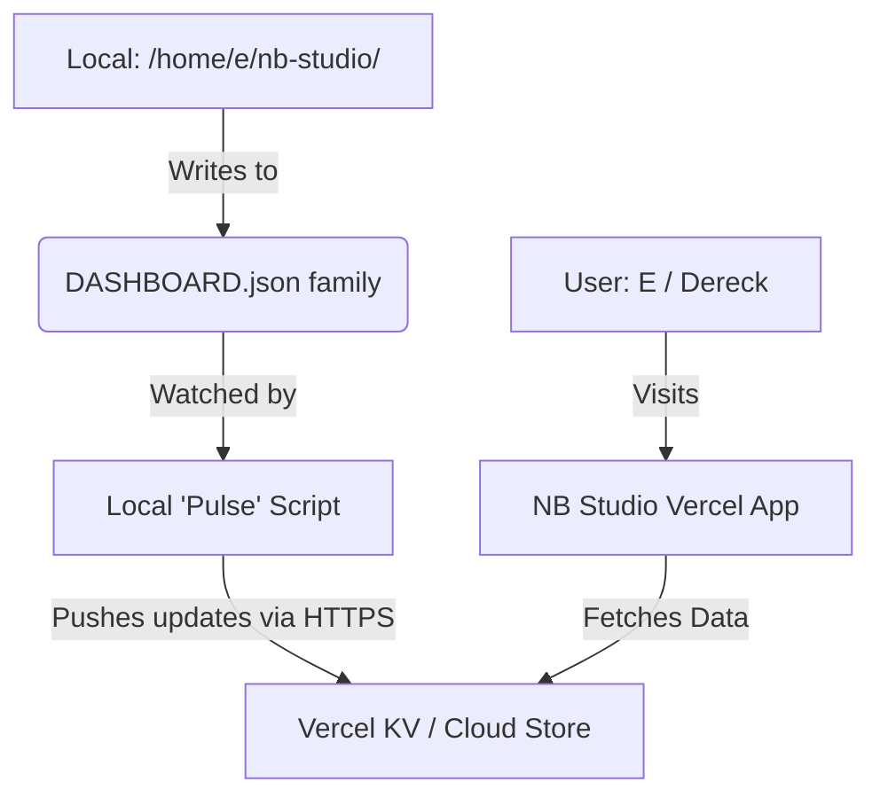

# NB Studio Improvement Plan: "Mission Control" Transformation

**Date:** February 19, 2026
**Target System:** OpenClaw / NB Studio Dashboard

## 1. Executive Summary

NB Studio is transitioning from a static landing page to a live "Mission Control" dashboard. The primary goal is to provide complete visibility and control over AI operations by bridging the gap between rich local data and a cloud-accessible interface.

This plan details the **"Local Heart, Cloud View"** architecture, which leverages your local file system as the source of truth while utilizing Vercel's edge infrastructure for global accessibility, maintaining strict cost guardrails (Target: $0/month for ops).

## 2. Architecture Vision: "Local Heart, Cloud View"

**Concept**: Treat local JSON files in `/home/e/nb-studio/` as the "Database". Use a lightweight "Uplink" script to sync essential data to a cloud cache (Vercel KV), decoupling the dashboard from the local machine's uptime while ensuring data freshness.

### The Stack
*   **Frontend**: Next.js 16 (App Router) + React 19 + Tailwind CSS.
*   **Data Transport**: Custom `pulse.js` Node.js script (Local).
*   **State Management**: Vercel KV (Free tier Redis).
*   **Local Store**: JSON files in `00_MISSION_CONTROL/`.

### Data Flow Diagram


## 3. Strategic Roadmap

### Phase 1: The Foundation (Weeks 1-2)
*   **Objective**: Merge `cost-analytics-v2` into the main repository and establish the data uplink.
*   **Actions**:
    *   Restructure repository to separate `web/` (Next.js) and `scripts/` (Local ops).
    *   Implement `pulse.js` to watch `DASHBOARD.json` and push changes.
    *   Create secure API endpoints (`/api/uplink`) on Vercel to receive data.
    *   Implement basic authentication middleware.

### Phase 2: Mission Control & Agents (Weeks 3-4)
*   **Objective**: Create the "Heads-up Display" (HUD).
*   **Actions**:
    *   Build the **Command Dashboard**: High-level KPIs (Spend, Active Agents, System Health).
    *   Build the **Neural Grid**: Visual status board for agents (Active/Idle/Error).
    *   Integrate System Health visuals (CPU/Memory gauges driven by `DATA_METRICS.json`).

### Phase 3: Department Portals (Week 5+)
*   **Objective**: Specialized views for functional roles.
*   **Actions**:
    *   **COO View**: Detailed cost breakdown, model vendor comparison, "Runway" analytics.
    *   **Growth View**: Content calendar derived from `SOCIAL_QUEUE`.
    *   **Engineering View**: Service status traffic lights for OpenClaw Gateway components.

## 4. Feature Specifications

### 4.1 Dynamic Dashboard (HUD)
*   **Visual Metaphor**: Sci-fi Cockpit (Dark Mode).
*   **The Ticker**: Scrolling top bar showing the latest completed task or alert.
*   **Vital Signs**: 3 Gauges (Daily Budget Consumed %, CPU Load, Error Rate).
*   **Activity Graph**: Sparkline showing token consumption over the last 6 hours.

### 4.2 Agent Status Page (Neural Grid)
*   **Swimlane Layout**:
    1.  **Queue**: Pending tasks.
    2.  **Active**: Cards with spinning loaders showing current step (e.g., "Analyzing API docs...").
    3.  **Done**: Recently completed items.
*   **Controls**: "Kill Switch" button to signal task cancellation to the local system.

### 4.3 Cost Analytics
*   **Runway Widget**: "At current daily spend ($0.41), you have infinite runway."
*   **Model Battle**: Chart comparing "Value for Money" (Tasks completed vs. Cost) across models.

## 5. Technical Execution Package

### Step 1: Directory Restructure
Move the Next.js application into a `web` subdirectory to separate it from operational scripts.

```text
/home/e/nb-studio/
├── 00_MISSION_CONTROL/       <-- Local JSON Data
├── scripts/                  <-- 'Pulse' script location
├── web/                      <-- Next.js 16 Dashboard
├── .env.local                <-- Secrets (NB_API_SECRET)
└── package.json              <-- Root config
```

### Step 2: The Pulse Script (`scripts/pulse.js`)
This script watches for file changes and syncs them to the cloud.

```javascript
const fs = require('fs');
const path = require('path');
const https = require('https');
require('dotenv').config({ path: path.join(__dirname, '../.env.local') });

const API_ENDPOINT = process.env.NB_API_ENDPOINT; 
const API_SECRET = process.env.NB_API_SECRET;
const WATCH_DIR = path.join(__dirname, '../00_MISSION_CONTROL');
const TARGETS = ['DASHBOARD.json', 'DASHBOARD_AGENTS.json', 'DATA_METRICS.json'];

let debounceTimer;

async function sendPulse() {
  console.log('[PULSE] Detecting change... Aggregating data...');
  const payload = { uplinkTime: new Date().toISOString() };

  try {
    TARGETS.forEach(file => {
      const filePath = path.join(WATCH_DIR, file);
      if (fs.existsSync(filePath)) {
        payload[file.replace('.json', '')] = JSON.parse(fs.readFileSync(filePath, 'utf8'));
      }
    });

    const dataString = JSON.stringify(payload);
    const url = new URL(API_ENDPOINT);
    
    const req = https.request({
      hostname: url.hostname,
      path: url.pathname,
      method: 'POST',
      headers: {
        'Content-Type': 'application/json',
        'Content-Length': dataString.length,
        'x-nb-secret': API_SECRET
      }
    }, (res) => {
      console.log(`[PULSE] Status: ${res.statusCode}`);
    });

    req.write(dataString);
    req.end();
  } catch (err) {
    console.error(`[PULSE] Error:`, err.message);
  }
}

if (fs.existsSync(WATCH_DIR)) {
  fs.watch(WATCH_DIR, (eventType, filename) => {
    if (filename && TARGETS.includes(filename)) {
      clearTimeout(debounceTimer);
      debounceTimer = setTimeout(sendPulse, 2000);
    }
  });
}
```

### Step 3: Cloud Receiver (`web/app/api/uplink/route.ts`)
The API route to receive data and store it in Vercel KV.

```typescript
import { NextResponse } from 'next/server';
import { kv } from '@vercel/kv';

export async function POST(request: Request) {
  try {
    const secret = request.headers.get('x-nb-secret');
    if (secret !== process.env.NB_API_SECRET) {
      return NextResponse.json({ error: 'Unauthorized' }, { status: 401 });
    }

    const data = await request.json();
    await kv.set('nb-studio-state', data); // Store entire state

    return NextResponse.json({ success: true, timestamp: Date.now() });
  } catch (error) {
    return NextResponse.json({ error: 'Internal Server Error' }, { status: 500 });
  }
}
```

### Step 4: Dashboard Data Fetcher (`web/app/api/dashboard/route.ts`)
The API route for the frontend to fetch the latest state.

```typescript
import { NextResponse } from 'next/server';
import { kv } from '@vercel/kv';

export async function GET() {
  const data = await kv.get('nb-studio-state');
  if (!data) return NextResponse.json({ status: 'No Data' }, { status: 404 });
  return NextResponse.json(data);
}
```

## 6. Cost & Risk Assessment

*   **Hosting**: Vercel Hobby (Free).
*   **Database**: Vercel KV (Free tier).
*   **Compute**: Local machine handles logic; Cloud handles display.
*   **Risk**: If local machine goes offline, dashboard shows stale data.
    *   *Mitigation*: UI displays "Last Updated" banner in red if data is > 10 mins old.
*   **Security**: Ensure `NB_API_SECRET` is strong and `.env` files are git-ignored.
